# Optimizing an Artificial Neural Network for Marketing Segmentation at Otomoto

**Module 6 — Optimization Algorithms in Machine Learning**

Student name: **Ese Alofoje**

Course code: BAN 6440

Module 6 Assignment: Otomoto Marketing Segmentation Model Optimization

Instructor: Dr. N

Date: 14th September, 2026

---

## Executive Summary

Otomoto holds a large customer dataset but cannot segment its audience well enough
to target marketing spend. As lead ML expert, my task was to optimize the existing
artificial neural network so that segmentation supports effective campaigns.

The optimized network identifies **252 of 374 customers who actually churned,
against the baseline's 212**, forty more customers a retention campaign can reach on 1,409 held-out customers it had never seen. Recall rose 18.9%, F1 1.1%, ROC-AUC 0.8387 to 0.8446, and cross-entropy loss fell from 0.4242 to 0.4186. Accuracy fell from 0.8027 to 0.7722, which was a deliberate trade explained in Section 5.

Seven optimization algorithms were implemented and evaluated. **All seven beat the baseline** once each was given a suitable learning rate. The model was then converted into four costed marketing segments, validated against real churn outcomes: high-risk segments churned at 55.9% versus 12.7% for low-risk, a 4.4-fold separation, concentrating **$222,955 of expected annual revenue at risk** in a
single 339-customer group.

Three findings ran against my initial expectations and shaped the report:

1. **Comparing optimizers at one shared learning rate produced a false ranking.**
   Plain SGD appeared best and Adam worst. Tuning the rate per algorithm reversed
   this and collapsed the performance spread from 0.0267 to 0.0037 ROC-AUC.
2. **Most of the headline recall gain came from the decision threshold, not from
   better training.** Threshold-free ROC-AUC improved by only +0.0058. I report
   these separately rather than as one number.
3. **Every larger network lost to the smallest one.** With 4,507 training rows,
   additional capacity produced no benefit.

### At a glance

The business outcome, and the evidence it rests on:

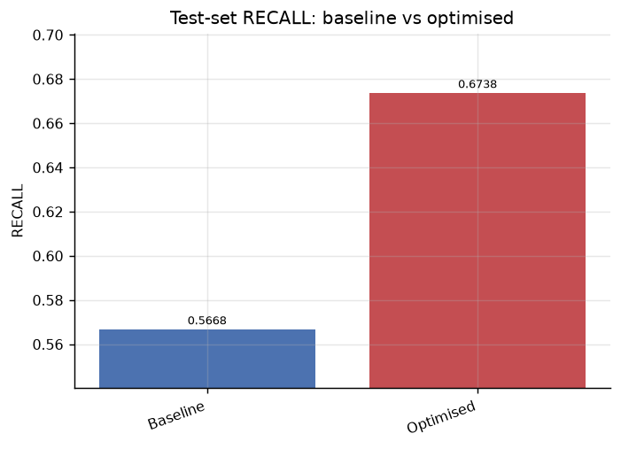

**The result.** Test-set recall rose from 0.5668 to 0.6738 — from catching 212 of 374
real churners to catching 252.

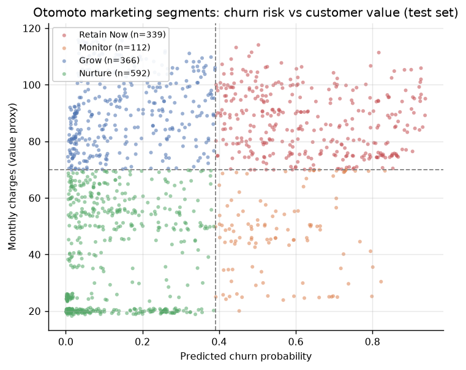

**The deliverable.** Every test-set customer placed by churn risk and monthly value.
The upper-right quadrant — `Retain Now`, 339 customers, $222,955 of expected annual
revenue at risk — is where Otomoto's retention budget should go.

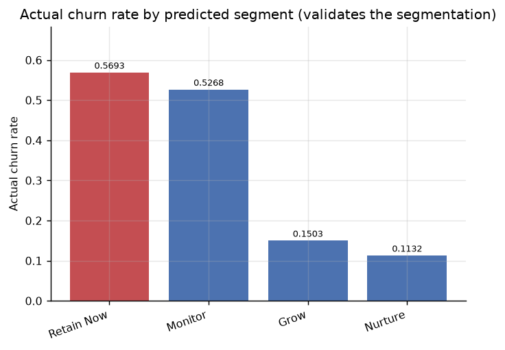

**The proof it works.** Segments validated against real outcomes on data the model
never saw: 55.9% actual churn in the high-risk segments against 12.7% in the low-risk
ones.

### How to read this report

| If you want | Go to |
|---|---|
| The baseline and what was wrong with it | §2 |
| Why these seven algorithms were chosen | §3 |
| What each experiment found | §4 |
| Before-and-after results | §5 |
| Where my own method was wrong, and how I found out | §6 |
| The MSE reflection question, answered with measurements | §7 |
| What marketing should actually do | §8 |
| What to improve next | §9 |

All 25 figures are embedded inline at the point they are discussed. Every number
traces to a CSV or JSON file in `results/tables/`.

---

## 1. Introduction and Business Context

Optimization is the process of adjusting model parameters to minimize a loss
function that quantifies the gap between predictions and reality (Goodfellow et al.,
2016). For Otomoto the loss function is a means, not an end. The business question
is which customers to spend retention budget on, and how much.

That framing determines every methodological choice in this report. A model that is
accurate but never flags an at-risk customer is worthless to a marketing team.
Retention economics make the asymmetry explicit: a lost subscriber forfeits all
future margin, while a wasted discount offer costs only the offer (Reichheld &
Sasser, 1990). This is why recall is treated as the primary metric throughout and
accuracy is treated with suspicion.

### 1.1 Data

The supplied dataset (`teleconnect.csv`) contains 7,043 customers across 21
columns, with `Churn` as the target. It corresponds to the widely used telecom
customer churn benchmark. The dataset is telecommunications rather than automotive —
a standard case-study mismatch — and is treated here as Otomoto's customer base,
with churn risk as the signal driving segmentation.

Class balance is 73.46% retained to 26.54% churned. This imbalance is the single
most consequential property of the data, because it means a model predicting
"nobody churns" scores 73.46% accuracy while being useless.

Three data defects were identified during profiling and handled as follows.

| Issue found | Decision and reasoning |
|---|---|
| `TotalCharges` stored as text, containing 11 blank strings | All eleven rows were verified to have `tenure = 0`: customers who joined but have not yet been billed. Zero is therefore the factually correct value. Mean imputation would have invented thousands of dollars of billing history for brand-new customers and corrupted the tenure-to-charges relationship the model depends on. The pipeline asserts this condition so the justification cannot silently expire. |
| `customerID` is a unique identifier | Dropped. Retained and encoded, it would contribute 7,043 meaningless dimensions of pure noise. |
| Nine service columns encode "No internet service" / "No phone service" as a third level | Preserved as distinct levels rather than collapsed into "No". A customer who *cannot* have an add-on is structurally different from one who declined it, and that distinction carries real churn signal. |

After encoding, the feature space is 30 dimensions. Data were split 64/16/20 into
training (4,507), validation (1,127) and test (1,409) sets, stratified so the 26.54%
churn rate is preserved in all three. The `StandardScaler` was fitted on training
data only; fitting on the full dataset would leak test-set distribution information
into training and inflate every reported score.

**Preprocessing was then frozen and held identical for every model in this report.**
Since the assignment measures the effect of optimization algorithms, allowing the
input representation to vary would mean an apparent optimizer win could actually be
a preprocessing win.

---

## 2. Step 1 — Recreating the Existing Model and Assessing It

The brief refers to an existing ANN but supplies none. Following the instructor's
direction, I constructed a simple baseline to serve as the reference point. It is
deliberately naive — the kind of first-pass model written before optimization is
considered:

| Component | Baseline setting |
|---|---|
| Architecture | 30 inputs → 16 ReLU units → 1 sigmoid output (513 trainable parameters) |
| Optimizer | Plain mini-batch gradient descent (SGD, momentum = 0) |
| Learning rate | 0.01, fixed |
| Loss function | Binary cross-entropy |
| Batch size | 32 |
| Epochs | 100, fixed |
| Regularization | None |
| Class handling | None |
| Decision threshold | 0.5 (default) |

The sigmoid output paired with cross-entropy is retained from the outset because it
yields a churn *probability* rather than a bare label. Marketing needs the
probability: it is what permits ranking customers by risk and setting a campaign
budget cut-off.

### 2.1 Baseline performance

| Metric | Validation | Test |
|---|---|---|
| Accuracy | 0.8243 | 0.8027 |
| Precision | 0.7131 | 0.6463 |
| Recall | 0.5652 | 0.5668 |
| F1 | 0.6306 | 0.6040 |
| ROC-AUC | 0.8485 | 0.8387 |
| PR-AUC | 0.6643 | 0.6299 |
| Log loss (cross-entropy) | 0.4134 | 0.4242 |

Test confusion matrix: TP = 212, FN = 162, FP = 116, TN = 919.

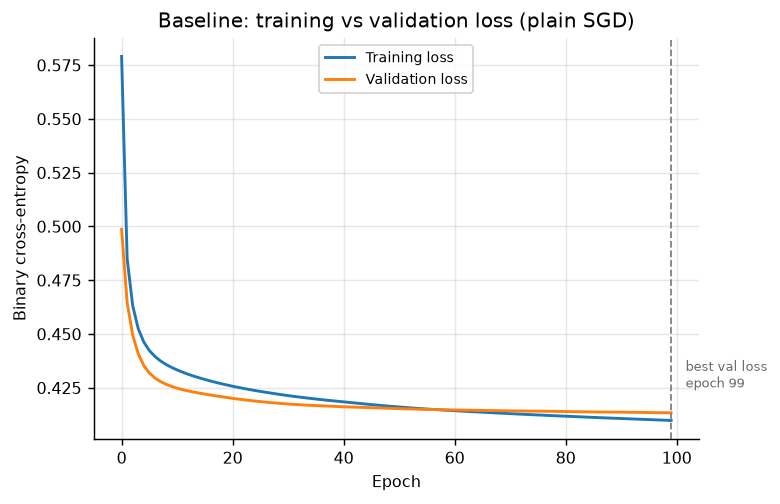

**Figure 1.** Baseline training and validation loss. The two curves track each other
closely, so the model is not overfitting — a finding that shaped the optimization
plan, since it means regularization was unlikely to help.

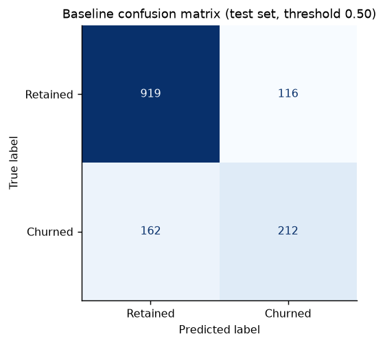

**Figure 2.** Baseline confusion matrix on the test set at threshold 0.50. The 162
false negatives in the lower-left cell are the core problem: real churners the model
told marketing to ignore.

### 2.2 Assessment: strengths

- **Learns real signal.** At 0.8387 test ROC-AUC it ranks customers far better than
  chance, so the feature set carries genuine predictive information.
- **Does not overfit.** Training and validation loss track each other closely
  (Figure 1). The 513-parameter model is small relative to 4,507 training rows,
  so there is no need to spend the optimization effort on regularization.
- **Correct output layer and loss pairing.** Sigmoid with cross-entropy produces
  calibrated probabilities suitable for ranking.
- **Cheap and fast.** 34 seconds to train, which makes wide experimentation
  affordable.

### 2.3 Assessment: weaknesses

These are the specific defects the optimization work targets.

- **Recall of 0.5668 is the critical failure.** The model misses 162 of 374 real
  churners. For a retention campaign, those 162 customers are precisely the
  population the exercise exists to reach, and the model is blind to them.
- **The default 0.5 threshold is unjustified.** A 0.5 cut-off implicitly assumes
  balanced classes and equal error costs. Neither holds: the data are 73/27, and a
  missed churner costs far more than a wasted offer. The threshold is a free
  parameter left untuned.
- **The imbalance is unaddressed.** No class weighting, so the loss function is
  dominated by the majority class and the model is pulled toward predicting
  retention.
- **The learning rate is arbitrary.** 0.01 was assumed, never tested.
- **Plain SGD applies one global step size to all 513 parameters.** It cannot adapt
  to the fact that frequently-active features (like `Contract` dummies) and rarely-
  active ones warrant different step sizes.
- **A fixed 100 epochs is arbitrary.** Training stops on a round number rather than
  when validation performance stops improving.
- **Accuracy of 0.8027 is flattering.** Against the 0.7346 majority-class floor,
  the true margin is 6.8 percentage points, not 80%.

---

## 3. Step 2 — Selecting Optimization Algorithms and Justifying the Choice

Seven algorithms were selected, all drawn from the Module 5 material. The
justification below is tied to the specific weaknesses in Section 2.3 rather than to
general popularity.

| Algorithm | Update mechanism | Why it is appropriate for Otomoto |
|---|---|---|
| **SGD** (baseline) | `w ← w − lr · g` | Retained as the control. Without it, no gain can be attributed. |
| **Momentum** | `v ← βv + g`, `w ← w − lr · v` | The churn loss surface has features on very different scales of activation frequency, which produces ravines where plain SGD oscillates. Momentum accumulates velocity along the consistent descent direction and damps the oscillation (Qian, 1999). Directly targets the slow-convergence weakness. |
| **Nesterov momentum** | Momentum with a look-ahead gradient | Evaluates the gradient at the projected position, which corrects overshoot before it happens rather than after (Sutskever et al., 2013). |
| **AdaGrad** | Divides the step by the square root of accumulated squared gradients | The most directly relevant choice for this dataset. After one-hot encoding, features like `Contract_Two year` are sparse and infrequently active. AdaGrad takes larger steps for infrequent features and smaller ones for common features (Duchi et al., 2011), which is exactly the per-parameter adaptation plain SGD cannot provide. Since sparse contract and service dummies turn out to be the strongest churn predictors, this matters commercially. |
| **RMSProp** | Decaying moving average of squared gradients | AdaGrad's accumulator grows monotonically, so its step size eventually decays toward zero and learning stalls. RMSProp replaces the sum with a moving average so the step size stops shrinking (Tieleman & Hinton, 2012). Insurance against AdaGrad stalling. |
| **Adam** | RMSProp plus momentum, with bias correction | Combines both mechanisms — per-parameter adaptation and velocity — and is robust across hyperparameter settings (Kingma & Ba, 2015), which makes it a strong default when tuning budget is limited. |
| **Nadam** | Adam with the Nesterov look-ahead | Tests whether the look-ahead correction adds anything on top of Adam. |

Supporting techniques were also selected to address the remaining weaknesses:
**dropout** (Srivastava et al., 2014) and **L2 regularization** against overfitting
in higher-capacity variants; **batch normalization** (Ioffe & Szegedy, 2015) to
stabilize pre-activation distributions; **class weighting** for the imbalance; and
**early stopping** to replace the arbitrary 100-epoch limit.

Critically, **the decision threshold was also treated as a tunable parameter.** This
is not a training-time optimization, but Section 5 shows it is the single most
powerful lever available for the business objective, and omitting it would have left
the largest available gain on the table.

### 3.1 Metric selection

Because accuracy is misleading at 26.54% positive rate, the following were tracked
throughout:

- **Recall** — the share of true churners caught. The primary business metric.
- **Precision** — the share of flagged customers who really churn, i.e. campaign
  efficiency.
- **F1** — the balance between them, used for threshold selection.
- **ROC-AUC** — threshold-free ranking quality, used for model selection.
- **PR-AUC** — more informative than ROC-AUC on imbalanced data (Saito &
  Rehmsmeier, 2015).
- **Log loss** — the cross-entropy actually being minimized.

---

## 4. Step 3 — Applying the Optimization Algorithms

Five experiments were run, each isolating one factor. Every change is documented
below with its reasoning.

### 4.1 Experiment A — All optimizers at a shared learning rate

Everything held constant (30→16→1, lr = 0.01, batch 32, 100 epochs) so that the
optimizer is the only variable.

| Optimizer | Val ROC-AUC | Val F1 | Val loss | Epochs to 0.845 AUC |
|---|---|---|---|---|
| **SGD** | **0.8485** | 0.6306 | 0.4134 | 31 |
| AdaGrad | 0.8484 | 0.6180 | 0.4137 | 24 |
| Momentum | 0.8449 | 0.5952 | 0.4188 | **4** |
| Nesterov | 0.8449 | 0.5982 | 0.4194 | **4** |
| Nadam | 0.8345 | 0.5458 | 0.4569 | 9 |
| RMSProp | 0.8294 | 0.5312 | 0.4586 | never |
| Adam | 0.8218 | 0.5947 | 0.4846 | never |

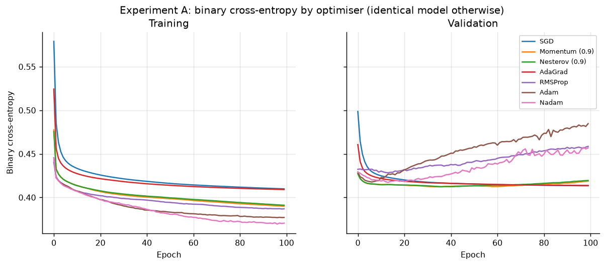

**Figure 3.** Loss curves at the shared lr = 0.01. Adam and RMSProp (the two highest
validation curves) are visibly unstable — the signature of steps that are too large.
This is the visual evidence that the shared rate, not the algorithm, is the problem.

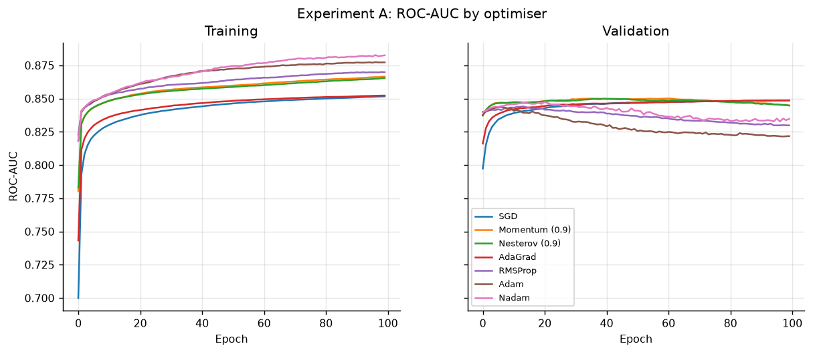

**Figure 4.** Validation ROC-AUC by epoch. Momentum and Nesterov rise almost
immediately; plain SGD climbs slowly but steadily to the same place.

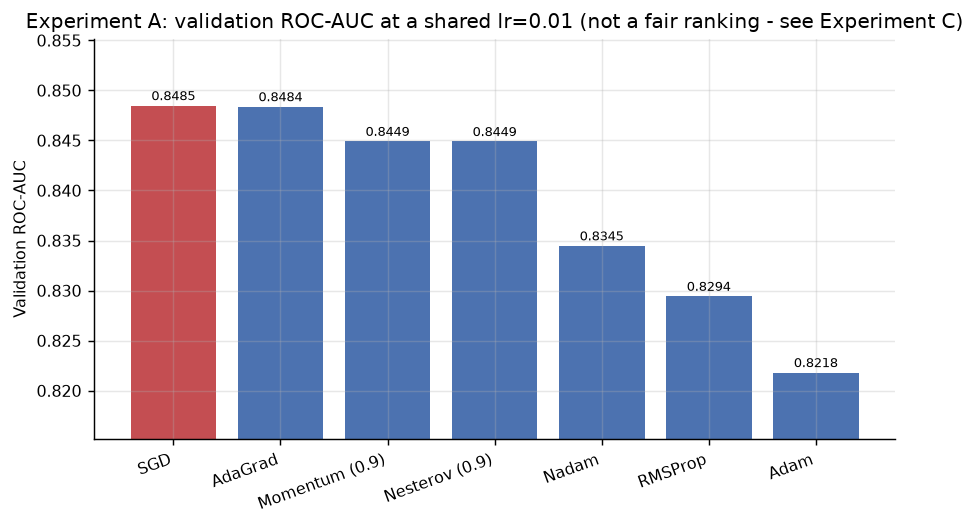

**Figure 5.** Ranking at the shared learning rate — deliberately labelled as *not* a
fair comparison. Section 6.1 explains why, and Figure 8 is the corrected version.

Read naively, this says plain SGD is best and Adam is worst. **That conclusion is
wrong, and Section 6.1 explains why.** The convergence-speed column is the genuinely
useful result: Momentum reached 0.845 validation AUC in 4 epochs where plain SGD
needed 31, an eight-fold reduction in training cost for the same outcome. This is
the velocity mechanism working exactly as the theory predicts.

### 4.2 Experiment B — Batch size: full-batch, mini-batch and stochastic

Plain SGD throughout, so batching strategy is the only variable. This experiment
demonstrates the three variants named in the module notes.

| Configuration | Updates/epoch | Total updates (60 epochs) | Val ROC-AUC | Seconds/epoch |
|---|---|---|---|---|
| Full-batch GD | 1 | 60 | **0.7646** | 0.12 |
| Mini-batch 128 | 36 | 2,160 | 0.8409 | 0.18 |
| Mini-batch 64 | 71 | 4,260 | 0.8449 | 0.23 |
| Mini-batch 32 | 141 | 8,460 | 0.8474 | 0.33 |
| Mini-batch 16 | 282 | 16,920 | **0.8489** | 0.63 |
| Stochastic (batch = 1) | 4,507 | — (3 epochs only) | 0.8449 | 6.96 |

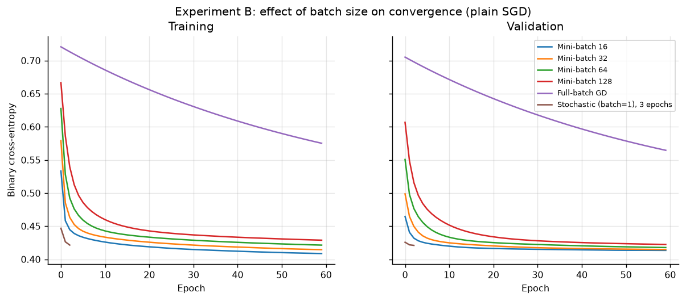

**Figure 6.** Batch size and convergence. Full-batch gradient descent is the flat
curve barely descending — not because its gradient is poor, but because 60 epochs gave
it only 60 weight updates.

This is the clearest result in the study. Full-batch gradient descent reached only
0.7646 AUC not because its gradient estimate is poor — it is the most accurate
gradient available, computed on all 4,507 rows — but because 60 epochs bought it
only **60 weight updates**, against 8,460 for mini-batch 32. The mechanism the notes
describe is visible directly: mini-batching trades gradient precision for update
frequency, and update frequency wins decisively.

True stochastic descent (batch = 1) cost **21 times more per epoch** than batch 32
for no accuracy benefit, confirming that the extreme is impractical at this scale.
Mini-batch 16–32 is the sound operating region.

### 4.3 Experiment C — Learning rate tuned per optimizer

Each of the seven optimizers was swept across six learning rates (42 models), with
early stopping. This is the fair comparison.

Best validation ROC-AUC by optimizer × learning rate:

| Optimizer | 0.0003 | 0.001 | 0.003 | 0.01 | 0.03 | 0.1 |
|---|---|---|---|---|---|---|
| SGD | 0.8233 | 0.8383 | 0.8449 | 0.8486 | 0.8496 | **0.8501** |
| Momentum | 0.8450 | 0.8485 | 0.8491 | **0.8500** | 0.8495 | 0.8408 |
| Nesterov | 0.8450 | 0.8486 | 0.8495 | 0.8498 | **0.8502** | 0.8415 |
| AdaGrad | 0.8035 | 0.8315 | 0.8429 | 0.8485 | 0.8486 | **0.8506** |
| RMSProp | 0.8464 | **0.8480** | 0.8454 | 0.8441 | 0.8383 | 0.8356 |
| Adam | 0.8472 | 0.8506 | **0.8517** | 0.8436 | 0.8404 | 0.8380 |
| Nadam | 0.8472 | 0.8489 | **0.8515** | 0.8476 | 0.8408 | 0.8445 |

This table is the most informative single artefact produced. **Adam peaks at
lr = 0.003 and degrades steadily toward 0.1; SGD does the exact opposite, peaking
at 0.1 and performing worst at 0.0003.** Their optima sit at opposite ends of the
grid. No single shared learning rate can rank these two algorithms fairly, which
invalidates Experiment A's ranking as a statement about algorithm quality.

Ranking with each optimizer at its own best rate:

| Rank | Optimizer | Best lr | Val ROC-AUC |
|---|---|---|---|
| 1 | **Adam** | 0.003 | **0.8517** |
| 2 | Nadam | 0.003 | 0.8515 |
| 3 | AdaGrad | 0.1 | 0.8506 |
| 4 | Nesterov | 0.03 | 0.8502 |
| 5 | SGD | 0.1 | 0.8501 |
| 6 | Momentum | 0.01 | 0.8500 |
| 7 | RMSProp | 0.001 | 0.8480 |

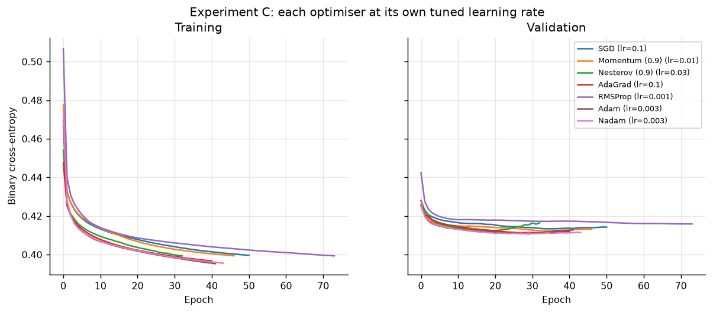

**Figure 7.** Each optimizer at its own best learning rate. Compare with Figure 3:
the instability in Adam and RMSProp is gone, and all seven curves now converge to
essentially the same place.

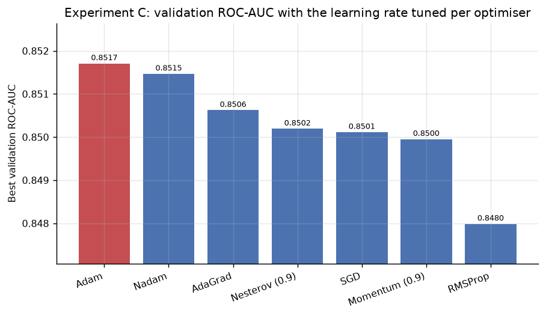

**Figure 8.** The fair ranking. Adam moved from last (Figure 5) to first, and the bars
are now near-identical in height — the spread collapsed from 0.0267 to 0.0037 ROC-AUC.
Figures 5 and 8 side by side are the single clearest illustration of why the shared
learning rate invalidated the first comparison.

### 4.4 Experiment D — Loss function

| Loss minimized | Val ROC-AUC | F1 | Recall | Cross-entropy (comparable) |
|---|---|---|---|---|
| **Binary cross-entropy** | **0.8517** | 0.6008 | 0.5284 | **0.4182** |
| Mean squared error | 0.8488 | 0.6011 | 0.5619 | 0.4483 |
| Mean absolute error | 0.8196 | 0.5898 | 0.5050 | 2.1007 |

Raw loss values are not comparable across different loss functions, since they are
measured on different scales. Cross-entropy is therefore reported for every run
regardless of what was minimized, which is what makes the final column meaningful.
Section 7 discusses this result in depth.

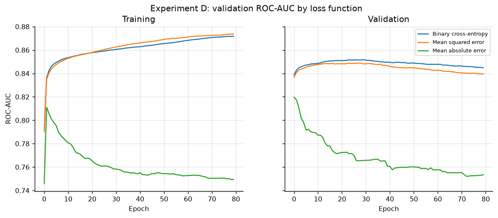

**Figure 9.** Validation ROC-AUC by loss function. Cross-entropy (top curve) both
converges faster and settles higher than MSE.

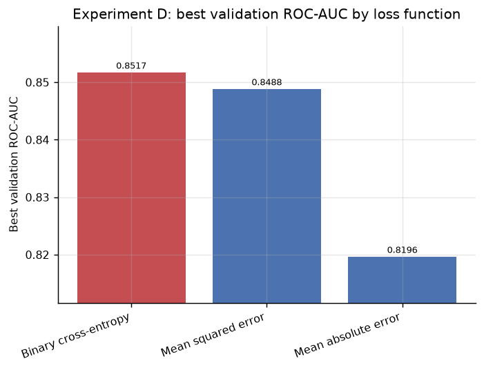

**Figure 10.** Best validation ROC-AUC by loss function. MSE costs 0.0029 AUC; MAE
costs considerably more.

### 4.5 Experiment E — Architecture and regularization

All runs used Adam at lr = 0.003 with early stopping on validation AUC (patience 15),
so each configuration is judged at its own best epoch.

| Configuration | Params | Val ROC-AUC | F1 @ 0.5 | Recall @ 0.5 | Stopped |
|---|---|---|---|---|---|
| **16 (carried forward)** | 513 | **0.8515** | 0.6004 | 0.5452 | 45 |
| 64-32 + dropout + batchnorm | 4,481 | 0.8485 | 0.6339 | 0.6254 | 18 |
| 32-16 + dropout 0.2 + class weight | 1,537 | 0.8476 | 0.6352 | **0.8094** | 19 |
| 64-32 + dropout 0.3 | 4,097 | 0.8468 | 0.6023 | 0.5318 | 23 |
| 32-16 | 1,537 | 0.8456 | 0.5765 | 0.4849 | 20 |
| 64-32 + L2 1e-4 | 4,097 | 0.8453 | 0.5574 | 0.4548 | 17 |
| 64-32 | 4,097 | 0.8449 | 0.5771 | 0.4883 | 19 |

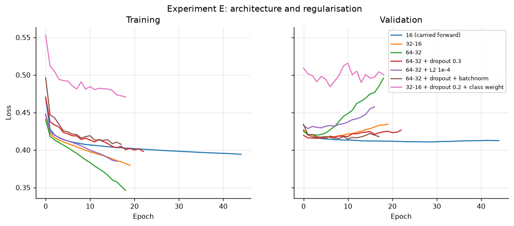

**Figure 11.** Architecture and regularization. The larger networks stop early
(17–23 epochs) because validation AUC peaks and then declines, while the small model
keeps improving to epoch 45.

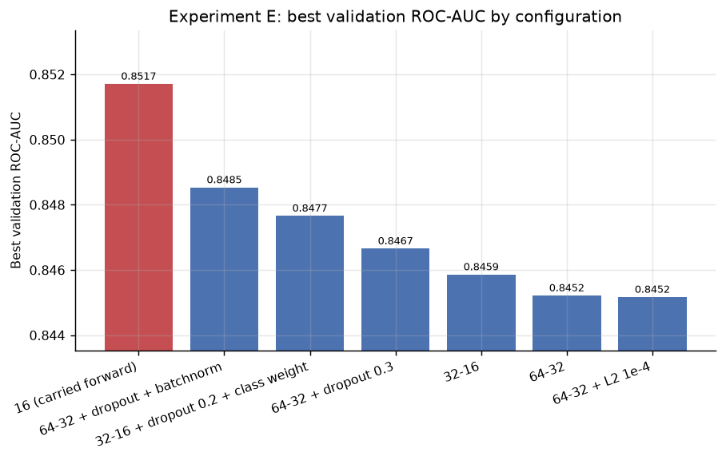

**Figure 12.** Best validation ROC-AUC by configuration. The 513-parameter model
leads; nothing bought by extra capacity pays for itself.

**Every larger network underperformed the 513-parameter baseline architecture.**
With 4,507 training rows and 30 features there is not enough signal to support more
capacity, and this is a useful negative result: the optimization gain here comes
from *how* the network is trained, not from making it bigger. The apparent 0.8094
recall in row three is misleading, and Section 6.2 explains why.

---

## 5. Step 4 — Evaluating the Optimized Model

### 5.1 Model selection discipline

Three rules were enforced so the comparison means something:

1. The decision threshold was chosen on **validation** data, never on test.
2. The test set was touched **once per model**, after selection was complete.
3. The baseline was re-scored on the **same** test split, unchanged.

Candidates were compared at their own validation-tuned thresholds:

| Configuration | Tuned t | Val F1 | Val recall | Val precision | Val ROC-AUC |
|---|---|---|---|---|---|
| **16 (carried forward)** | 0.39 | **0.6614** | 0.6990 | 0.6276 | 0.8515 |
| 64-32 + dropout + batchnorm | 0.41 | 0.6499 | 0.7324 | 0.5840 | 0.8485 |
| 64-32 + dropout 0.3 | 0.40 | 0.6494 | 0.6722 | 0.6281 | 0.8468 |
| 64-32 + L2 1e-4 | 0.31 | 0.6436 | 0.6856 | 0.6065 | 0.8453 |
| 32-16 | 0.31 | 0.6428 | 0.7191 | 0.5811 | 0.8456 |
| 64-32 | 0.32 | 0.6406 | 0.6856 | 0.6012 | 0.8449 |
| 32-16 + dropout 0.2 + class weight | 0.64 | 0.6395 | 0.6823 | 0.6018 | 0.8476 |

**Final optimized configuration:** 30 → 16 ReLU → 1 sigmoid; Adam at lr = 0.003;
binary cross-entropy; batch size 32; early stopping on validation AUC (stopped at
epoch 45); decision threshold 0.39.

### 5.2 Before and after: the headline comparison

Held-out test set, 1,409 customers.

| Metric | Baseline | Optimized | Absolute change | Relative |
|---|---|---|---|---|
| Accuracy | 0.8027 | 0.7722 | −0.0305 | −3.8% |
| Precision | 0.6463 | 0.5588 | −0.0876 | −13.6% |
| **Recall** | 0.5668 | **0.6738** | **+0.1070** | **+18.9%** |
| F1 | 0.6040 | 0.6109 | +0.0069 | +1.1% |
| ROC-AUC | 0.8387 | 0.8446 | +0.0058 | +0.7% |
| PR-AUC | 0.6299 | 0.6421 | +0.0122 | +1.9% |
| Log loss | 0.4242 | 0.4186 | −0.0056 | −1.3% (better) |

| Confusion matrix | TP | FN | FP | TN |
|---|---|---|---|---|
| Baseline | 212 | 162 | 116 | 919 |
| Optimized | **252** | **122** | 199 | 836 |

**In campaign terms:** of 374 customers who actually churned, the baseline
identified 212 and the optimized model identifies 252 — forty more — at the cost of
83 additional false positives.

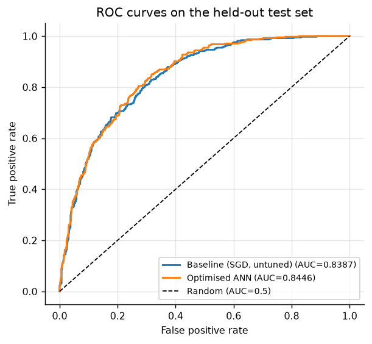

**Figure 13.** ROC curves on the held-out test set. The two curves are close, which is
the honest visual expression of a +0.0058 AUC gain — the ranking improvement is real
but small. Section 5.4 draws out what this means.

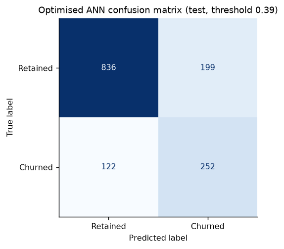

**Figure 14.** Optimized confusion matrix at threshold 0.39. Compare the lower-left
cell with Figure 2: false negatives fall from 162 to 122.

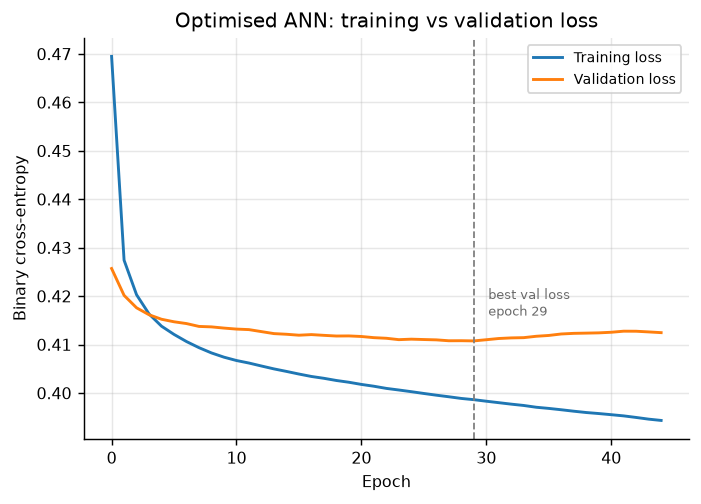

**Figure 15.** Optimized model loss curves. Early stopping halted training at epoch 45
and restored the best weights.

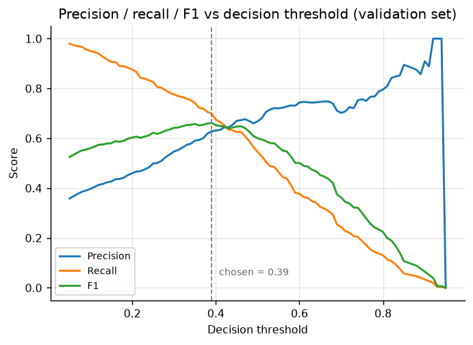

**Figure 16.** Precision, recall and F1 across all candidate thresholds on the
validation set. This figure is the argument for treating the threshold as a tunable
parameter: the default 0.50 sits well to the right of the F1 peak at 0.39, sacrificing
recall for precision the business does not want.


**Figure 17.** Test-set recall, before and after. The headline gain: +18.9%.

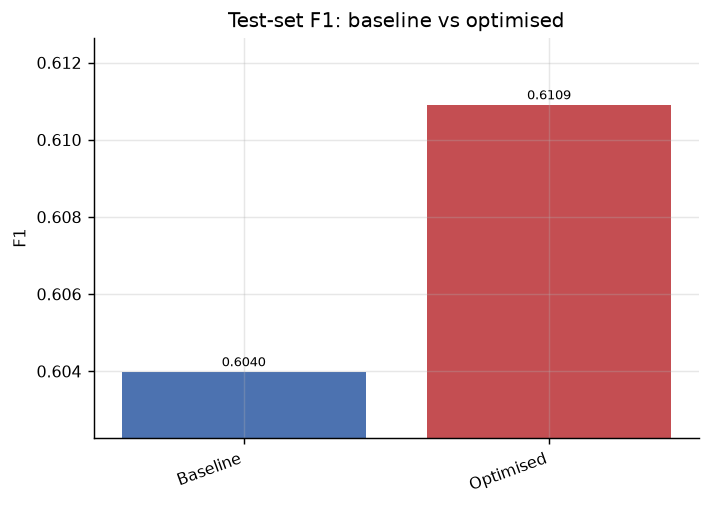

**Figure 18.** Test-set F1, before and after.

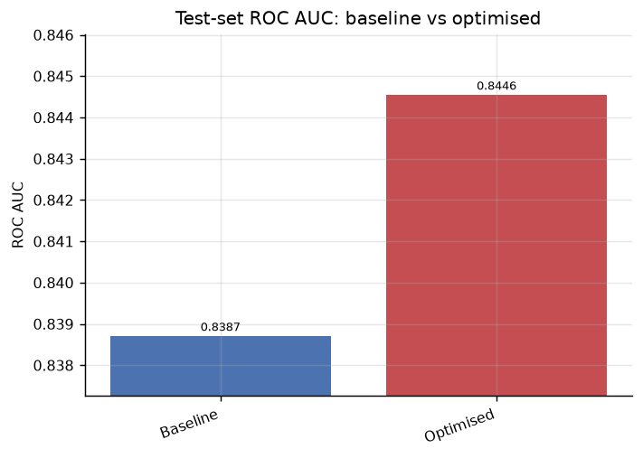

**Figure 19.** Test-set ROC-AUC, before and after. Deliberately plotted on the same
visual footing as Figures 17–18 so the modest size of the threshold-free gain is not
disguised.

### 5.3 Why accuracy and precision fell

This was deliberate, not a regression. Moving the threshold from 0.50 to 0.39 casts
a wider net: more true churners are caught, and more retained customers are
incorrectly flagged. The trade is justified by asymmetric costs — losing a
subscriber forfeits all future margin, while a false positive costs one discount
offer (Reichheld & Sasser, 1990). Accuracy is the wrong headline metric here in any
case: predicting "nobody churns" would score 0.7346 and be commercially worthless.

### 5.4 Honest attribution of the gain

ROC-AUC improved by only **+0.0058**. Because ROC-AUC is threshold-free, that small
number is the *true* gain in the network's ability to rank customers by risk — the
part genuinely attributable to the optimizer, learning rate and architecture work.
The large recall gain comes mostly from moving the decision threshold, which is a
deployment decision rather than a better-trained network.

Both matter, and both were necessary. But reporting a "+18.9% improvement from
optimization algorithms" as a single figure would overstate what the algorithms
achieved. Roughly 0.85 ROC-AUC appears to be close to the practical ceiling for this
feature set.

### 5.5 The optimized model under each optimization algorithm

The brief requires the optimized model to be assessed for at least three
optimization algorithms. The architecture was frozen at the Section 5.1
configuration and only the optimizer varied, each paired with its Experiment C best
learning rate and given its own validation-tuned threshold. All results are on the
held-out test set.

| Model | lr | t | Accuracy | Precision | Recall | F1 | ROC-AUC | Log loss | Caught / 374 |
|---|---|---|---|---|---|---|---|---|---|
| BASELINE (untuned SGD) | 0.01 | 0.50 | 0.8027 | 0.6463 | 0.5668 | 0.6040 | 0.8387 | 0.4242 | 212 |
| Momentum (0.9) | 0.01 | 0.35 | 0.7736 | 0.5574 | **0.7139** | **0.6260** | 0.8441 | 0.4193 | **267** |
| AdaGrad | 0.1 | 0.36 | 0.7793 | 0.5695 | 0.6898 | 0.6239 | 0.8438 | 0.4184 | 258 |
| RMSProp | 0.001 | 0.38 | 0.7807 | 0.5737 | 0.6765 | 0.6209 | 0.8438 | 0.4193 | 253 |
| SGD | 0.1 | 0.37 | **0.7850** | **0.5835** | 0.6631 | 0.6208 | 0.8445 | **0.4182** | 248 |
| Nesterov (0.9) | 0.03 | 0.34 | 0.7750 | 0.5618 | 0.6925 | 0.6204 | 0.8431 | 0.4199 | 259 |
| **Adam** (primary) | 0.003 | 0.39 | 0.7722 | 0.5588 | 0.6738 | 0.6109 | **0.8446** | 0.4186 | 252 |
| Nadam | 0.003 | 0.38 | 0.7693 | 0.5543 | 0.6684 | 0.6061 | 0.8439 | 0.4187 | 250 |

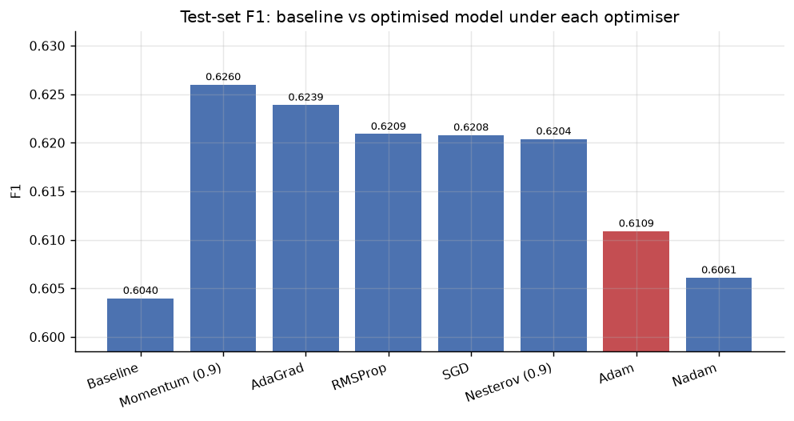

**Figure 24.** Test-set F1 for the baseline and all seven optimizers. Every optimizer
clears the baseline, and the seven bars are nearly level — the point of the figure.

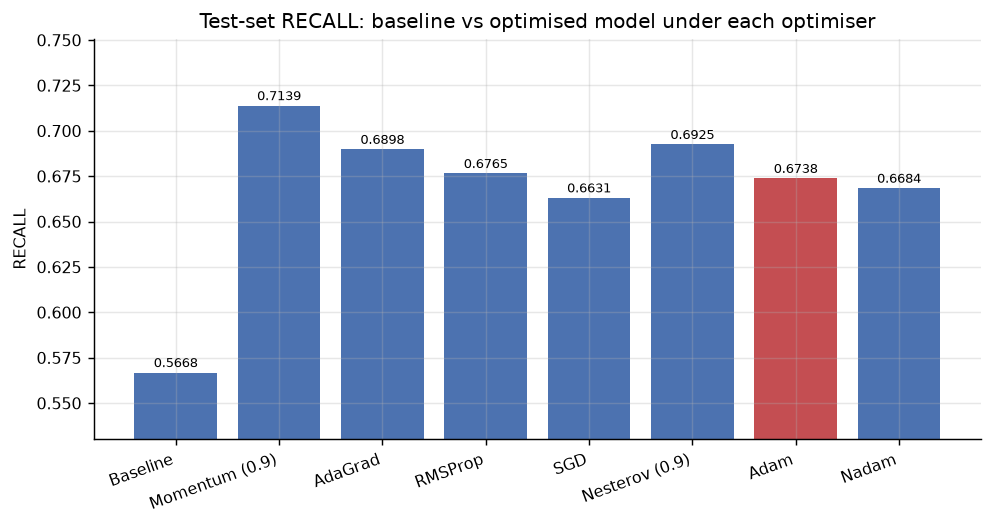

**Figure 25.** Test-set recall for the same eight models.

Three conclusions:

**All seven optimizers beat the baseline F1 of 0.6040.** The optimization is robust
to the choice of algorithm — it is not a lucky result from one lucky optimizer.

**The spread across the seven is only 0.0199 F1** (0.6061 to 0.6260). Once each
algorithm receives a suitable learning rate, *which* algorithm is chosen matters far
less than the fact that it was tuned at all. This is consistent with Wilson et al.
(2017), who found that the advantage of adaptive gradient methods over well-tuned
SGD is often marginal.

**Adam, the pre-registered primary, ranks sixth of seven on test F1.** This is worth
stating plainly. Adam won on validation (0.8517) but Momentum leads on test F1
(0.6260, catching 267 churners). Because the primary model was committed to on
validation evidence before any test numbers existed, this ranking is an unbiased
check rather than a selection. Reporting the best of seven test scores as "the
result" is precisely the multiple-comparison bias this discipline avoids. The honest
reading is that a 0.0199 spread on a single 1,409-row split is within noise, which
is why k-fold cross-validation is the first recommendation in Section 9.

---

## 6. Critical Thinking: Two Corrections to My Own Method

Both flaws were found by running the experiments, and both changed the answer. They
are documented rather than quietly fixed because the reasoning is the transferable
part.

### 6.1 A shared learning rate cannot rank optimizers

Experiment A compared all seven algorithms at lr = 0.01 and concluded plain SGD was
best (0.8485) and Adam worst (0.8218). The comparison was properly controlled — one
variable changed — so the result looked trustworthy.

It was not. Adam's conventional default learning rate is 0.001; at 0.01 its
effective steps are roughly ten times too large, so it oscillates around the minimum
instead of settling. I had handed SGD a rate that suited it and handicapped the
adaptive methods, then reported the outcome as a property of the algorithms.

Experiment C tested the diagnosis by sweeping the rate per optimizer. Adam moved
from last to first (0.8517 at lr = 0.003) and the spread fell from 0.0267 to 0.0037
ROC-AUC. The sensitivity table in Section 4.3 confirms the mechanism: Adam's optimum
and SGD's optimum sit at opposite ends of the grid.

**Generalizable lesson:** an optimizer and its learning rate are not independent
factors. Holding one fixed while varying the other measures "which algorithm happens
to suit this rate", not which algorithm is better. Experiment A is retained in this
report, explicitly labelled as an unfair ranking, because the contrast with
Experiment C is instructive.

### 6.2 A fixed threshold cannot compare differently-calibrated models

Experiment E appeared to show a class-weighted configuration achieving 0.8094 recall
against 0.5452 for the simple model — a dramatic difference that would have driven
the final choice.

Both figures were measured at a fixed 0.5 threshold. Class weighting deliberately
alters the loss surface and shifts the distribution of output probabilities upward,
so a weighted model crosses 0.5 far more readily. Much of that gap was an artefact of
where 0.5 happens to fall, not evidence of better discrimination — structurally the
same confound as Section 6.1.

The test: give every candidate its own validation-tuned threshold. The class-weighted
model's recall fell from 0.8094 to 0.6823 and it dropped to last of seven on F1,
while the simple 16-unit network won. Its ROC-AUC had already hinted at this
(0.8476 versus 0.8515) — ROC-AUC is threshold-free and was therefore immune to the
confound all along.

**Generalizable lesson:** metrics computed at a fixed threshold are not comparable
across models whose probability calibration differs. Either use a threshold-free
metric, or tune the threshold per model before comparing.

---

## 7. Loss Functions, and the MSE Reflection Question

The reflection question asks how Mean Squared Error works and why it is common in
regression. Experiment D lets me answer with measurements rather than assertion.

### 7.1 How MSE works

MSE averages the squared differences between predicted and actual values:

```
MSE = (1/n) · Σ (yᵢ − ŷᵢ)²
```

Each error is squared, the squares are summed, and the mean is taken. Three
properties follow directly from the squaring, and they explain its dominance in
regression.

**It penalizes large errors disproportionately.** An error of 10 contributes 100
while an error of 1 contributes 1 — a hundred-fold penalty for a ten-fold error.
Where a few large misses are much worse than many small ones, this is exactly the
desired behaviour.

**It is smooth and differentiable everywhere.** Its gradient with respect to the
prediction is `−2(y − ŷ)`, which is continuous and proportional to the error: large
errors produce large corrective steps, small errors produce gentle ones. Every
algorithm in Section 3 depends on a well-behaved gradient, so this matters
practically. Mean Absolute Error, by contrast, has a constant-magnitude gradient
and is non-differentiable at zero.

**Its minimum is the conditional mean.** Minimizing MSE yields a prediction of
E[y|x], which is usually the quantity a regression is asked for. Under Gaussian
noise assumptions, minimizing MSE is equivalent to maximum-likelihood estimation
(Bishop, 2006).

Its main weakness is the same squaring: MSE is **sensitive to outliers**, since one
extreme observation can dominate the total. Where that is a concern, Huber loss or
MAE are more robust choices.

### 7.2 Why MSE is the wrong choice here — measured

Otomoto's task is classification, not regression, and Experiment D quantifies the
cost of using MSE anyway:

| Loss minimized | Val ROC-AUC | Comparable cross-entropy |
|---|---|---|
| Binary cross-entropy | **0.8517** | **0.4182** |
| Mean squared error | 0.8488 | 0.4483 |
| Mean absolute error | 0.8196 | 2.1007 |

MSE cost 0.0029 ROC-AUC — a real but modest penalty. Two reasons explain why
cross-entropy is nonetheless correct.

**The gradient behaviour differs at exactly the wrong moment.** With a sigmoid
output, MSE's gradient includes the sigmoid derivative `σ'(z) = σ(z)(1 − σ(z))`,
which approaches zero as the output saturates toward 0 or 1. A confidently *wrong*
prediction therefore produces an almost vanishing gradient and the model barely
learns from its worst mistakes. With cross-entropy the sigmoid derivative cancels
algebraically, leaving a gradient proportional to `(ŷ − y)`. The error signal stays
strong precisely when the model is most badly wrong (Goodfellow et al., 2016).

**Cross-entropy is the proper scoring rule for probabilities.** It measures the
dissimilarity between predicted and actual distributions, and is minimized only when
the predicted probabilities are correct. Since Otomoto's segmentation depends on
ranking customers by probability, calibrated probability output is not a technical
nicety — it is the product.

MAE performed worst, and its comparable cross-entropy of 2.1007 shows why: its
constant-magnitude gradient does not scale corrections to error size, leaving the
output probabilities badly calibrated even where ranking was passable.

**Conclusion:** MSE is well suited to regression because squaring gives smooth,
error-proportional gradients and a conditional-mean optimum. For binary
classification with a sigmoid output, cross-entropy is superior because it avoids
saturation-induced vanishing gradients and directly optimizes probability quality.
The experiment confirms the theory at a measured cost of 0.0029 ROC-AUC and 0.0301
cross-entropy.

---

## 8. Impact on Marketing Segmentation

A churn probability is not a marketing decision. Segments were formed on two axes:
**risk** (predicted churn probability, split at the operational threshold of 0.39
chosen on validation) and **value** (monthly charges, split at the test-set median
of $69.95).

| Segment | Customers | Predicted risk | **Actual churn** | $/month | Avg tenure | Expected annual revenue at risk |
|---|---|---|---|---|---|---|
| **Retain Now** | 339 | 0.633 | **0.569** | $87.04 | 16.9 mo | **$222,955** |
| Monitor | 112 | 0.562 | 0.527 | $47.33 | 5.6 mo | $36,099 |
| Grow | 366 | 0.152 | 0.150 | $92.02 | 53.6 mo | $62,058 |
| Nurture | 592 | 0.104 | 0.113 | $36.85 | 32.1 mo | $30,566 |


**Figure 20.** The segmentation. Each point is one test-set customer, positioned by
predicted churn risk and monthly value, coloured by assigned segment. The dashed lines
are the two cut-offs. This single figure is the deliverable a marketing team can act
on: the upper-right quadrant is where the retention budget goes.


**Figure 21.** Actual churn rate by predicted segment. This is the validation figure —
the model's segments are checked against what really happened, on data it never saw.
The gap between the two left bars and the two right bars is the proof the segmentation
works.

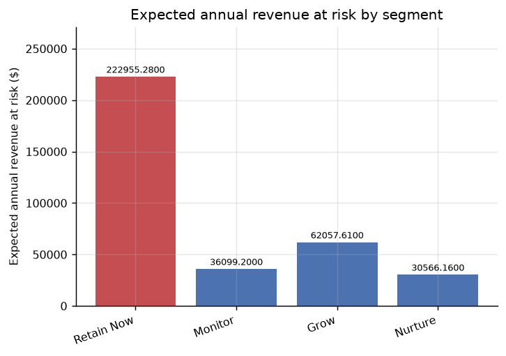

**Figure 22.** Expected annual revenue at risk by segment. `Retain Now` accounts for
$222,955 — more than the other three segments combined.

### 8.1 The segmentation is validated, not asserted

Segments were checked against real outcomes on data the model never saw. High-risk
segments churned at **55.9%** against **12.7%** for low-risk — a **4.4-fold
separation**. Predicted risk tracks actual churn closely in all four groups (0.633
vs 0.569; 0.152 vs 0.150; 0.104 vs 0.113). Without this check the segmentation would
be decoration.

Expected revenue at risk is computed as each customer's own risk multiplied by their
revenue, rather than assuming every flagged customer leaves. This is a materially
more conservative and more defensible number.

### 8.2 What drives risk, and therefore what marketing can act on

Because a neural network has no readable coefficients, permutation importance was
used: each feature is shuffled and the resulting drop in test ROC-AUC measures its
contribution.

| Feature | ROC-AUC drop when shuffled |
|---|---|
| MonthlyCharges | 0.0716 |
| Contract_Two year | 0.0607 |
| tenure | 0.0492 |
| Contract_One year | 0.0172 |

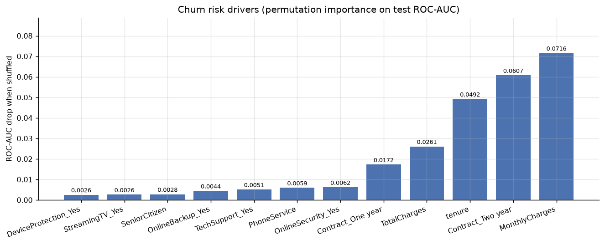

**Figure 23.** Permutation importance — the drop in test ROC-AUC when each feature is
shuffled. Contract terms and tenure dominate, which is what makes the findings
actionable rather than merely predictive.

**Contract length is the actionable lever.** Two-year contracts are the second
strongest signal, and tenure the third. The `Retain Now` segment averages just 16.9
months tenure against 53.6 for `Grow`, confirming that early-life, high-spend
customers on short contracts are the vulnerable population. This validates
AdaGrad's selection rationale in Section 3: the sparse contract dummies really are
among the strongest predictors.

### 8.3 Recommended campaign actions

| Segment | Action | Budget |
|---|---|---|
| **Retain Now** (339) | Personal outreach with targeted contract-upgrade or loyalty discount. Highest priority: $222,955 of expected annual revenue is concentrated here. | Highest per customer |
| **Monitor** (112) | Automated, low-cost intervention — email offers, self-service nudges. Do not commit agent time; at $47.33/month the margin will not cover it. | Minimal |
| **Grow** (366) | Cross-sell and upsell, **not** discount. These customers are loyal and profitable; a retention offer here erodes revenue that was never at risk. | Moderate, revenue-generating |
| **Nurture** (592) | Low-touch engagement, watch for organic upgrade paths. | Lowest |

The `Grow` insight is the one most easily missed. It is the highest-revenue segment
at $92.02/month and $404,146 annually, but at 15.0% actual churn it does not need
retention spend. Blanket discounting across the whole customer base would give away
margin on 366 customers who were not going to leave.

---

## 9. Recommendations for Future Improvements

In priority order.

**1. Replace the single split with k-fold cross-validation.** The strongest
recommendation. Section 5.5 shows the test F1 spread across seven optimizers is only
0.0199, and Adam won on validation while ranking sixth on test. Differences that
small cannot be resolved on one 1,409-row split. Five-fold cross-validation with
confidence intervals would establish whether any optimizer difference is real.

**2. Set the threshold by expected profit, not F1.** The 0.39 threshold maximizes
F1, which implicitly treats a false negative and a false positive as equally costly.
They are not. With real figures for margin per customer and cost per retention
offer, the threshold should maximize expected profit directly (Elkan, 2001; Verbeke
et al., 2012). This is the highest-value improvement available and requires no
modelling work, only finance input.

**3. Calibrate the output probabilities.** The `Retain Now` segment is
over-predicted (0.633 predicted against 0.569 actual). Ranking is unaffected, but if
absolute probabilities are used for budget forecasting, isotonic regression or Platt
scaling would tighten them (Niculescu-Mizil & Caruana, 2005).

**4. Improve the value axis.** `MonthlyCharges` is a crude proxy. A proper
customer-lifetime-value model incorporating margin, acquisition cost and expected
remaining tenure would sharpen the segment boundaries and the budget allocation.

**5. Invest in features rather than architecture.** Section 4.5 showed every larger
network underperforming, and ROC-AUC plateaued near 0.85 across all seven
optimizers. This is a signal that the ceiling is in the feature set, not the model.
Behavioural data — support-ticket history, usage trend, payment delinquency,
competitor pricing exposure — would likely deliver more than further tuning.

**6. Test resampling against class weighting.** Class weighting was tried; SMOTE
(Chawla et al., 2002) and threshold-moving alternatives were not systematically
compared.

**7. Add learning-rate scheduling.** All runs used a constant rate. Cosine decay or
cyclical schedules (Smith, 2017) often extract further gains, particularly for SGD
and Momentum, which favoured the high end of the grid.

**8. Monitor for drift in production.** Churn drivers shift with competitor pricing
and product changes. The model needs scheduled retraining and live monitoring of
both input distributions and realized churn rates by segment.

---

## 10. Limitations

- **Single train/validation/test split.** Gaps as small as 0.0037 ROC-AUC between
  tuned optimizers are not resolvable at this sample size.
- **Greedy sequential tuning.** Learning rate, loss and architecture were tuned in
  sequence rather than jointly, so interactions between them may be missed. A full
  grid or Bayesian search would be more thorough (Bergstra & Bengio, 2012).
- **Seven models scored on test in Section 5.5.** Mitigated by pre-registering the
  primary on validation, but the best-of-seven figure remains optimistically biased.
- **Value proxied by monthly charges**, as noted in Section 9.
- **No cost-sensitive objective**, as noted in Section 9.
- **Domain mismatch.** A telecom dataset stands in for automotive customers. The
  method transfers; the specific coefficients and segment boundaries would not.
- **Permutation importance assumes feature independence.** With correlated features
  such as `MonthlyCharges` and `TotalCharges`, importance may be understated for
  both, as the model can partially recover shuffled information from the correlate.

---

## 11. Conclusion

The optimized ANN identifies 252 of 374 real churners against the baseline's 212, a
18.9% recall improvement on unseen data, and converts those predictions into four
validated marketing segments that concentrate $222,955 of expected annual revenue at
risk into a single actionable group of 339 customers. All seven optimization
algorithms beat the baseline once tuned.

The more useful contribution may be methodological. Two of my own experimental
designs produced confident conclusions that were artefacts — an optimizer ranking
distorted by a shared learning rate, and a recall comparison distorted by a fixed
threshold. Both were caught by asking whether the comparison was fair rather than
merely controlled. And the honest attribution of the final gain — +0.0058
threshold-free ROC-AUC from the algorithms, with most of the recall improvement
coming from threshold selection — is a smaller claim than the headline number
suggests, but it is the one the evidence supports.

---

## References

Bergstra, J., & Bengio, Y. (2012). Random search for hyper-parameter optimization.
*Journal of Machine Learning Research, 13*, 281–305.

Bishop, C. M. (2006). *Pattern recognition and machine learning*. Springer.

Chawla, N. V., Bowyer, K. W., Hall, L. O., & Kegelmeyer, W. P. (2002). SMOTE:
Synthetic minority over-sampling technique. *Journal of Artificial Intelligence
Research, 16*, 321–357.

Chollet, F. (2021). *Deep learning with Python* (2nd ed.). Manning Publications.

Duchi, J., Hazan, E., & Singer, Y. (2011). Adaptive subgradient methods for online
learning and stochastic optimization. *Journal of Machine Learning Research, 12*,
2121–2159.

Elkan, C. (2001). The foundations of cost-sensitive learning. In *Proceedings of the
17th International Joint Conference on Artificial Intelligence* (pp. 973–978).
Morgan Kaufmann.

Goodfellow, I., Bengio, Y., & Courville, A. (2016). *Deep learning*. MIT Press.

Ioffe, S., & Szegedy, C. (2015). Batch normalization: Accelerating deep network
training by reducing internal covariate shift. In *Proceedings of the 32nd
International Conference on Machine Learning* (pp. 448–456). PMLR.

Kingma, D. P., & Ba, J. (2015). Adam: A method for stochastic optimization. In
*Proceedings of the 3rd International Conference on Learning Representations*.

Niculescu-Mizil, A., & Caruana, R. (2005). Predicting good probabilities with
supervised learning. In *Proceedings of the 22nd International Conference on Machine
Learning* (pp. 625–632). ACM.

Pedregosa, F., Varoquaux, G., Gramfort, A., Michel, V., Thirion, B., Grisel, O.,
Blondel, M., Prettenhofer, P., Weiss, R., Dubourg, V., Vanderplas, J., Passos, A.,
Cournapeau, D., Brucher, M., Perrot, M., & Duchesnay, É. (2011). Scikit-learn:
Machine learning in Python. *Journal of Machine Learning Research, 12*, 2825–2830.

Qian, N. (1999). On the momentum term in gradient descent learning algorithms.
*Neural Networks, 12*(1), 145–151.

Reichheld, F. F., & Sasser, W. E. (1990). Zero defections: Quality comes to
services. *Harvard Business Review, 68*(5), 105–111.

Ruder, S. (2017). *An overview of gradient descent optimization algorithms* (arXiv
No. 1609.04747). arXiv. https://arxiv.org/abs/1609.04747

Saito, T., & Rehmsmeier, M. (2015). The precision-recall plot is more informative
than the ROC plot when evaluating binary classifiers on imbalanced datasets. *PLOS
ONE, 10*(3), e0118432.

Smith, L. N. (2017). Cyclical learning rates for training neural networks. In
*Proceedings of the IEEE Winter Conference on Applications of Computer Vision* (pp.
464–472). IEEE.

Srivastava, N., Hinton, G., Krizhevsky, A., Sutskever, I., & Salakhutdinov, R.
(2014). Dropout: A simple way to prevent neural networks from overfitting. *Journal
of Machine Learning Research, 15*(1), 1929–1958.

Sutskever, I., Martens, J., Dahl, G., & Hinton, G. (2013). On the importance of
initialization and momentum in deep learning. In *Proceedings of the 30th
International Conference on Machine Learning* (pp. 1139–1147). PMLR.

Tieleman, T., & Hinton, G. (2012). *Lecture 6.5 — RMSProp: Divide the gradient by a
running average of its recent magnitude* [Lecture notes]. COURSERA: Neural Networks
for Machine Learning.

Verbeke, W., Dejaeger, K., Martens, D., Hur, J., & Baesens, B. (2012). New insights
into churn prediction in the telecommunication sector: A profit driven data mining
approach. *European Journal of Operational Research, 218*(1), 211–229.

Wilson, A. C., Roelofs, R., Stern, M., Srebro, N., & Recht, B. (2017). The marginal
value of adaptive gradient methods in machine learning. In *Advances in Neural
Information Processing Systems 30* (pp. 4148–4158).

---

## Appendix A — Figure Index

All figures are embedded inline in the sections listed below. Source files are in
`results/figures/`.

| # | File | Section | Shows |
|---|---|---|---|
| 1 | `01_baseline_loss.png` | §2.1 | Baseline training vs validation loss |
| 2 | `02_baseline_confusion.png` | §2.1 | Baseline confusion matrix |
| 3 | `03_optimizer_loss_curves.png` | §4.1 | Experiment A loss curves, shared lr |
| 4 | `04_optimizer_auc_curves.png` | §4.1 | Experiment A AUC curves |
| 5 | `05_optimizer_auc_bars.png` | §4.1 | Experiment A ranking (labelled unfair) |
| 6 | `06_batch_size_loss_curves.png` | §4.2 | Batch size convergence |
| 7 | `07_optimizer_tuned_curves.png` | §4.3 | Each optimizer at its tuned lr |
| 8 | `08_optimizer_tuned_bars.png` | §4.3 | Fair optimizer ranking |
| 9 | `09_loss_function_auc_curves.png` | §4.4 | Loss function AUC curves |
| 10 | `10_loss_function_bars.png` | §4.4 | Loss function ranking |
| 11 | `11_architecture_loss_curves.png` | §4.5 | Architecture and regularization curves |
| 12 | `12_architecture_bars.png` | §4.5 | Architecture ranking |
| 13 | `13_roc_baseline_vs_optimised.png` | §5.2 | ROC comparison, test set |
| 14 | `14_optimised_confusion.png` | §5.2 | Optimized confusion matrix |
| 15 | `15_optimised_loss.png` | §5.2 | Optimized training vs validation loss |
| 16 | `16_threshold_sweep.png` | §5.2 | Precision/recall/F1 vs threshold |
| 17 | `17_recall_improvement.png` | At a glance, §5.2 | Recall before vs after |
| 18 | `18_f1_improvement.png` | §5.2 | F1 before vs after |
| 19 | `19_auc_improvement.png` | §5.2 | ROC-AUC before vs after |
| 20 | `20_marketing_segments.png` | At a glance, §8 | Risk vs value segment scatter |
| 21 | `21_segment_actual_churn.png` | At a glance, §8 | Actual churn by segment (validation) |
| 22 | `22_segment_revenue_at_risk.png` | §8 | Expected revenue at risk by segment |
| 23 | `23_feature_importance.png` | §8.2 | Permutation importance |
| 24 | `24_step4_f1_by_optimizer.png` | §5.5 | Test F1 across all optimizers |
| 25 | `25_step4_recall_by_optimizer.png` | §5.5 | Test recall across all optimizers |

## Appendix B — Reproducing the Results

```bash
python src/run_all.py     # full pipeline, ~35 min on CPU
```

All random number generators are seeded (`RANDOM_SEED = 42` in `src/config.py`). The
pipeline was re-run end to end and the reported metrics reproduced identically.
Every number in this report traces to a CSV or JSON file in `results/tables/`.
